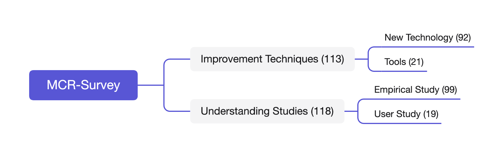
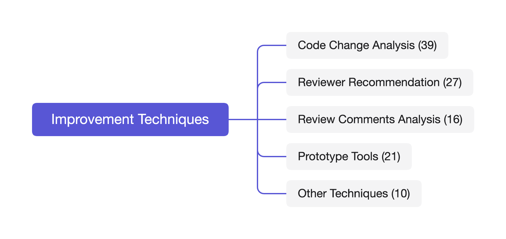
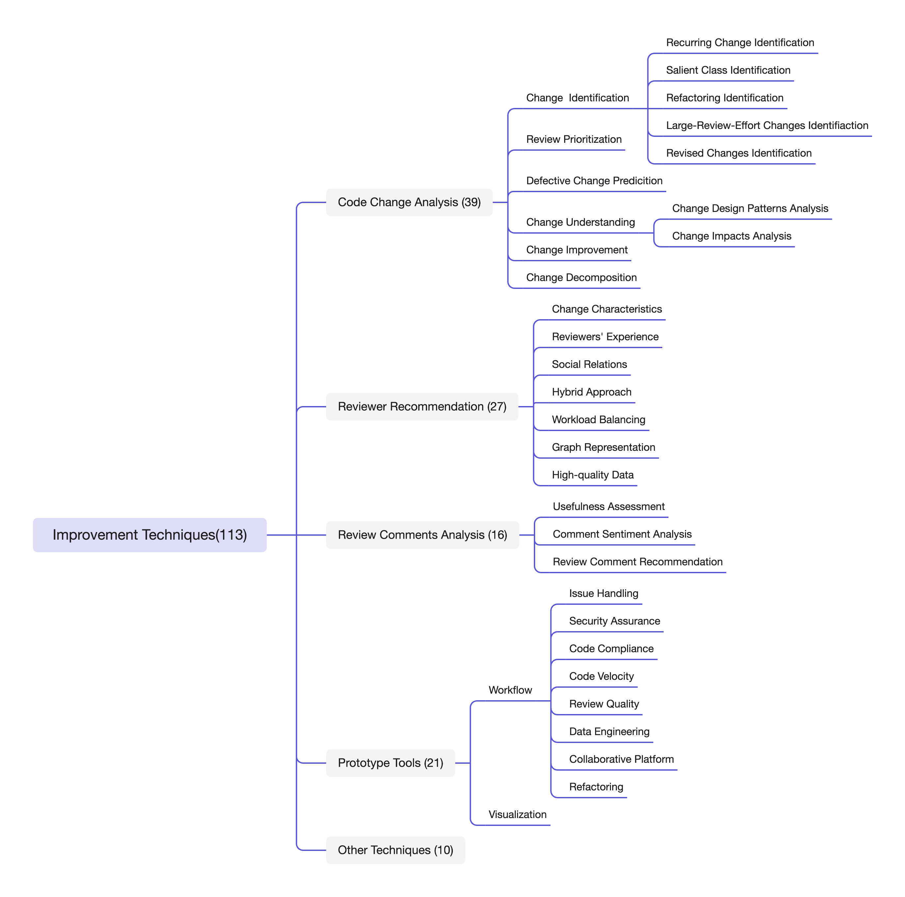
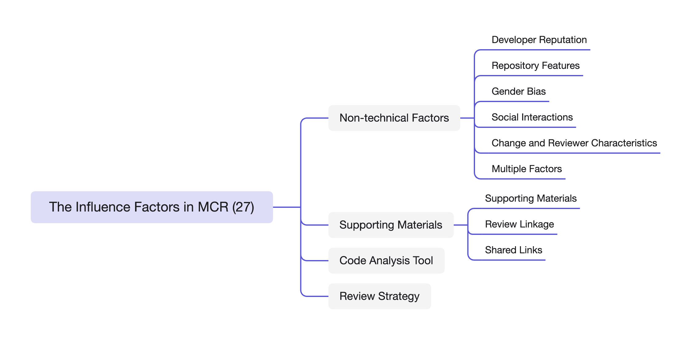
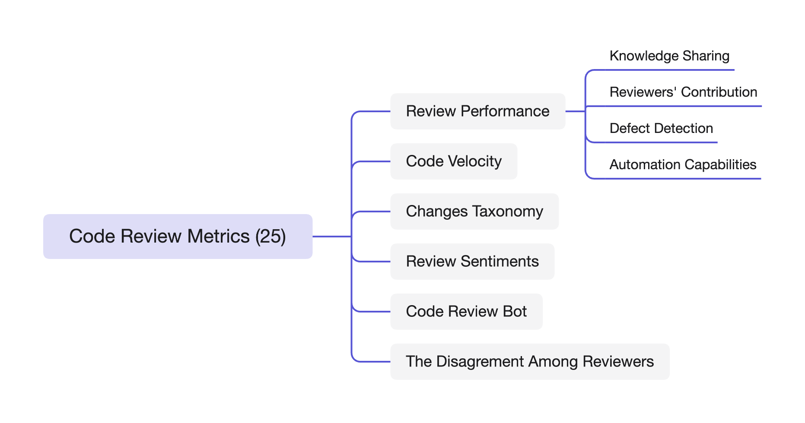

# Survey of Modern Code Review (MCR) 
In this repository, we collected papers related to modern code review (MCR) from Jan. 2013 to Feb. 2024. We propose a taxonomy of MCR tasks, aiming to assist developers and researchers to gain a better understanding of MCR. More detailed information can be found in our paper "Understanding and Enhancing Modern Code Review: Progresses, Challenges and Opportunities".

## Overview

## Catalogue

### Improvement Techniques

#### Code Change Analysis

##### Code Identification

* Recurring change identification

  2013

  [LASE: locating and applying systematic edits by learning from examples](https://ieeexplore.ieee.org/abstract/document/6606596/)

  2015

  [Interactive code review for systematic changes](https://ieeexplore.ieee.org/abstract/document/7194566/)

  2020

  [Code inspection support for recurring changes with deep learning in evolving software](https://ieeexplore.ieee.org/abstract/document/9202813/)

* Salient class identification

  2022

  [Code review knowledge perception: Fusing multi-features for salient-class location](https://ieeexplore.ieee.org/abstract/document/9186620/)

* refactoring identification

  2017

  [Tool support for managing clone refactorings to facilitate code review in evolving software](https://ieeexplore.ieee.org/abstract/document/8029620/)

* Large-Review-Effort changes identification

  2019

  [Leveraging change intents for characterizing and identifying large-review-effort changes](https://dl.acm.org/doi/abs/10.1145/3345629.3345635)

* Revised changes identification

  2019

  [Automatic code review by learning the revision of source code](https://ojs.aaai.org/index.php/AAAI/article/view/4420)

##### Review Prioritization

2013

[0-1 Programming Model-Based Method for Planning Code Review Using Bug Fix History](https://ieeexplore.ieee.org/abstract/document/6754348/)

2015

[Automatically prioritizing pull requests](https://ieeexplore.ieee.org/abstract/document/7180094/)

[Work practices and challenges in pull-based development: The integrator's perspective](https://ieeexplore.ieee.org/abstract/document/7194588/)

2018

[Early prediction of merged code changes to prioritize reviewing tasks](https://link.springer.com/article/10.1007/s10664-018-9602-0)

2019

[Improving the pull requests review process using learning-to-rank algorithms](https://link.springer.com/article/10.1007/s10664-019-09696-8)

2021

[Using machine intelligence to prioritise code review requests](https://ieeexplore.ieee.org/abstract/document/9402093/)

2022

[Reviewing rounds prediction for code patches](https://link.springer.com/article/10.1007/s10664-021-10035-z)

[Early prediction for merged vs abandoned code changes in modern code reviews](https://www.sciencedirect.com/science/article/pii/S0950584921002032)

2024

[A multi-objective effort-aware approach for early code review prediction and prioritization](https://link.springer.com/article/10.1007/s10664-023-10431-7)

##### Defective Change Identification

2016

[Predicting defectiveness of software patches](https://dl.acm.org/doi/abs/10.1145/2961111.2962601)

2017

[Code review analysis of software system using machine learning techniques](https://ieeexplore.ieee.org/abstract/document/7855962/)

[A case study on machine learning model for code review expert system in software engineering](https://ieeexplore.ieee.org/abstract/document/8104731/)

2019

[Using Stack Overflow content to assist in code review](https://onlinelibrary.wiley.com/doi/abs/10.1002/spe.2706)

2021

[Using Paragraph Vectors to improve our existing code review assisting tool-CRUSO](https://dl.acm.org/doi/abs/10.1145/3452383.3452393)

[Rigorous code review by reverse engineering](https://www.sciencedirect.com/science/article/pii/S0950584920302457)

2022

[Where should i look at? recommending lines that reviewers should pay attention to](https://ieeexplore.ieee.org/abstract/document/9825760/)

2023

[A multi-step learning approach to assist code review](https://ieeexplore.ieee.org/abstract/document/10123491/)

##### Change Understanding

* Design

  2013

  [Supporting Automatic Code Review via Design](https://ieeexplore.ieee.org/abstract/document/6616346/)

  2021

  [Predicting design impactful changes in modern code review: A large-scale empirical study](https://ieeexplore.ieee.org/abstract/document/9463137/)

* Impact

  2018

  [Blimp tracer: Integrating build impact analysis with code review](https://ieeexplore.ieee.org/abstract/document/8530081/)

  2019

  [Aiding code change understanding with semantic change impact analysis](https://ieeexplore.ieee.org/abstract/document/8918947/)

##### Change Improvement

2019

[Mining source code improvement patterns from similar code review works](https://ieeexplore.ieee.org/abstract/document/8665852/)

2021

[Towards automating code review activities](https://ieeexplore.ieee.org/abstract/document/9402025/)

2022

[Autotransform: Automated code transformation to support modern code review process](https://dl.acm.org/doi/abs/10.1145/3510003.3510067)

2023

[Towards Automated Code Reviews: Does Learning Code Structure Help?](https://ieeexplore.ieee.org/abstract/document/10123547/)

[D-act: Towards diff-aware code transformation for code review under a time-wise evaluation](https://ieeexplore.ieee.org/abstract/document/10123643/)

##### Change Decomposition

2015

[Helping developers help themselves: Automatic decomposition of code review changesets](https://ieeexplore.ieee.org/abstract/document/7194568/)

[Partitioning composite code changes to facilitate code review](https://ieeexplore.ieee.org/abstract/document/7180078/)

2018

[Automatic decomposition of java open source pull requests: a replication study](https://link.springer.com/chapter/10.1007/978-3-319-73117-9_18)

2019

[The effects of change decomposition on code review—a controlled experiment](https://peerj.com/articles/cs-193.pdf)

[Decomposing composite changes for code review and regression test selection in evolving software](https://link.springer.com/article/10.1007/s11390-019-1917-9)

[Cora: Decomposing and describing tangled code changes for reviewer](https://ieeexplore.ieee.org/abstract/document/8952413/)

#### Reviewer Recommendation

##### Change characteristics

2013

[Reducing human effort and improving quality in peer code reviews using automatic static analysis and reviewer recommendation](https://ieeexplore.ieee.org/abstract/document/6606642/)

[Who should review my code? a file location-based code-reviewer recommendation approach for modern code review](https://ieeexplore.ieee.org/abstract/document/7081824/)

2015

[Who should review this change?: Putting text and file location analyses together for more accurate recommendations](https://ieeexplore.ieee.org/abstract/document/7332472/)

2023

[Code reviewer recommendation for architecture violations: An exploratory study](https://dl.acm.org/doi/abs/10.1145/3593434.3593450)

##### Reviewers' experience

2016

[Automatically recommending code reviewers based on their expertise: An empirical comparison](https://dl.acm.org/doi/abs/10.1145/2970276.2970306)

[Search-based peer reviewers recommendation in modern code review](https://ieeexplore.ieee.org/abstract/document/7816482/)

[Correct: code reviewer recommendation in github based on cross-project and technology experience](https://dl.acm.org/doi/abs/10.1145/2889160.2889244)

[Automatically recommending peer reviewers in modern code review](https://ieeexplore.ieee.org/abstract/document/7328331/)

2020

[ADCR: An Adaptive TOOL to select” Appropriate Developer for Code Review” based on Code Context](https://ieeexplore.ieee.org/abstract/document/9298102/)

##### Social relations

2016

[Reviewer recommendation for pull-requests in GitHub: What can we learn from code review and bug assignment?](https://www.sciencedirect.com/science/article/pii/S0950584916000069)

2017

[Who should comment on this pull request? analyzing attributes for more accurate commenter recommendation in pull-based development](https://www.sciencedirect.com/science/article/pii/S095058491630283X)

2023

[Using large-scale heterogeneous graph representation learning for code review recommendations at microsoft](https://ieeexplore.ieee.org/abstract/document/10172555/)

##### Hybrid approaches

2017

[A hybrid approach to code reviewer recommendation with collaborative filtering](https://ieeexplore.ieee.org/abstract/document/8100850/)

2022

[Intelligent Code Review Assignment for Large Scale Open Source Software Stacks](https://dl.acm.org/doi/abs/10.1145/3551349.3561147)

[Recommending code reviewers for proprietary software projects: A large scale study](https://ieeexplore.ieee.org/abstract/document/9825901/)

[Corms: a github and gerrit based hybrid code reviewer recommendation approach for modern code review](https://dl.acm.org/doi/abs/10.1145/3540250.3549115)

##### Workload balancing

2019

[Whodo: Automating reviewer suggestions at scale](https://dl.acm.org/doi/abs/10.1145/3338906.3340449)

2020

[Does reviewer recommendation help developers?](https://ieeexplore.ieee.org/abstract/document/8453850/)

[Multi-objective code reviewer recommendations: balancing expertise, availability and collaborations](https://link.springer.com/article/10.1007/s10515-020-00275-6)

2023

[Integrating Visual Aids to Enhance the Code Reviewer Selection Process](https://ieeexplore.ieee.org/abstract/document/10336290/)

2024

[Factoring Expertise, Workload, and Turnover into Code Review Recommendation](https://ieeexplore.ieee.org/abstract/document/10444097/)

##### Graph representations

2019

[Reviewer recommendation using software artifact traceability graphs](https://dl.acm.org/doi/abs/10.1145/3345629.3345637)

2021

[Reviewer recommendation using software artifact traceability graphs](https://dl.acm.org/doi/abs/10.1145/3345629.3345637)

2022

[Modeling review history for reviewer recommendation: A hypergraph approach](https://dl.acm.org/doi/abs/10.1145/3510003.3510213)

2023

[A code reviewer recommendation approach based on attentive neighbor embedding propagation](https://www.mdpi.com/2079-9292/12/9/2113)

##### High-quality Data

2021

[Detection and elimination of systematic labeling bias in code reviewer recommendation systems](https://dl.acm.org/doi/abs/10.1145/3463274.3463336)

2024

[Distilling Quality Enhancing Comments from Code Reviews to Underpin Reviewer Recommendation](https://ieeexplore.ieee.org/abstract/document/10411501/)

#### Review Comment Analysis

##### Usefulness Assessment

2014

[Assessing MCR discussion usefulness using semantic similarity](https://ieeexplore.ieee.org/abstract/document/6976022/)

2017

[Confusion detection in code reviews](https://ieeexplore.ieee.org/abstract/document/8094460/)

[Predicting usefulness of code review comments using textual features and developer experience](https://ieeexplore.ieee.org/abstract/document/7962371/)

2021

[Using a balanced scorecard to identify opportunities to improve code review effectiveness: An industrial experience report](https://link.springer.com/article/10.1007/s10664-021-10038-w)

2022

[Automated code review comment classification to improve modern code reviews](https://link.springer.com/chapter/10.1007/978-3-031-04115-0_3)

2023

[EvaCRC: Evaluating Code Review Comments](https://dl.acm.org/doi/abs/10.1145/3611643.3616245)

##### Comment Sentiment Analysis

2017

[SentiCR: A customized sentiment analysis tool for code review interactions](https://ieeexplore.ieee.org/abstract/document/8115623/)

2020

[Predicting developers' negative feelings about code review](https://dl.acm.org/doi/abs/10.1145/3377811.3380414)

2022

[Detecting interpersonal conflict in issues and code review: cross pollinating open-and closed-source approaches](https://dl.acm.org/doi/abs/10.1145/3510458.3513019)

2023

[ToxiSpanSE: An Explainable Toxicity Detection in Code Review Comments](https://ieeexplore.ieee.org/abstract/document/10304855/)

##### Review Comment Recommendation

2018

[Diggit: Automated code review via software repository mining](https://ieeexplore.ieee.org/abstract/document/8330261/)

[Intelligent code reviews using deep learning](https://www.kdd.org/kdd2018/files/deep-learning-day/DLDay18_paper_40.pdf)

2020

[Core: Automating review recommendation for code changes](https://ieeexplore.ieee.org/abstract/document/9054794/)

2022

[Commentfinder: a simpler, faster, more accurate code review comments recommendation](https://dl.acm.org/doi/abs/10.1145/3540250.3549119)

[Example driven code review explanation](https://dl.acm.org/doi/abs/10.1145/3544902.3546639)

2023

[Recommending Code Reviews Leveraging Code Changes with Structured Information Retrieval](https://ieeexplore.ieee.org/abstract/document/10336317/)

#### Other Techniques

2014

[Clustering commits for understanding the intents of implementation](https://ieeexplore.ieee.org/abstract/document/6976107/)

2020

[Affect recognition in code review: An in-situ biometric study of reviewer's affect](https://www.sciencedirect.com/science/article/pii/S0164121219302080)

2021

[Automatic patch linkage detection in code review using textual content and file location features](https://www.sciencedirect.com/science/article/pii/S0950584921001038)

2022

[Leveraging test plan quality to improve code review efficacy](https://dl.acm.org/doi/abs/10.1145/3540250.3558952)

[Automating code review activities by large-scale pre-training](https://dl.acm.org/doi/abs/10.1145/3540250.3549081)

[Using pre-trained models to boost code review automation](https://dl.acm.org/doi/abs/10.1145/3510003.3510621)

2023

[LLaMA-Reviewer: Advancing Code Review Automation with Large Language Models through Parameter-Efficient Fine-Tuning](https://ieeexplore.ieee.org/abstract/document/10299938/)

[Automatic code review by learning the structure information of code graph](https://www.mdpi.com/1424-8220/23/5/2551)

2024

[Structuring Meaningful Code Review Automation in Developer Community](https://www.sciencedirect.com/science/article/pii/S0952197623011545)

[Code Review Automation: Strengths and Weaknesses of the State of the Art](https://ieeexplore.ieee.org/abstract/document/10378848/)

#### Prototype Tools

##### Workflow

* Issue handling

  2013

  [Fix-it: An extensible code auto-fix component in review bot](https://ieeexplore.ieee.org/abstract/document/6648198/)

  2018

  [Clonemap: A clone-aware code inspection tool in evolving software](https://ieeexplore.ieee.org/abstract/document/8500143/)

* Security assurance

  2023

  [Towards verifiable web-based code review systems](https://content.iospress.com/articles/journal-of-computer-security/jcs210098)

  [Are your dependencies code reviewed?: Measuring code review coverage in dependency updates](https://ieeexplore.ieee.org/abstract/document/10266387/)

* Code Compliance

  2018

  [What makes a code change easier to review: an empirical investigation on code change reviewability](https://dl.acm.org/doi/abs/10.1145/3236024.3236080)

  [Code compliance assessment as a learning problem](https://ieeexplore.ieee.org/abstract/document/10172520/)

* Code velocity

  2022

  [Using nudges to accelerate code reviews at scale](https://dl.acm.org/doi/abs/10.1145/3540250.3549104)

  2023

  [Generative Pre-Trained Transformer (GPT) Models as a Code Review Feedback Tool in Computer Science Programs](https://www.ccsc.org/publications/journals/NW2023.pdf#page=38)

* Review quality

  2021

  [iReview: An intelligent code review evaluation tool using biofeedback](https://ieeexplore.ieee.org/abstract/document/9700337/)

  2023

  [Towards Better Code Reviews: Using Mutation Testing to Improve Reviewer Attention](https://ieeexplore.ieee.org/abstract/document/10169070/)

  [Automated identification of toxic code reviews using toxicr](https://dl.acm.org/doi/abs/10.1145/3583562)

* Data engineering

  2015

  [Lessons learned from building and deploying a code review analytics platform](https://ieeexplore.ieee.org/abstract/document/7180079/)

* Collaborative platform

  2016

  [A collaborative code review platform for github](https://ieeexplore.ieee.org/abstract/document/7816585/)

  2017

  [Semantics-assisted code review: An efficient tool chain and a user study](https://ieeexplore.ieee.org/abstract/document/8115666/)

* Refactoring

  2017

  [Refactoring-aware code review](https://ieeexplore.ieee.org/abstract/document/8103453/)

  2021

  [RAID: Tool support for refactoring-aware code reviews](https://ieeexplore.ieee.org/abstract/document/9463030/)

##### Visualization

2015

[Code review: Veni, vidi, vici](https://ieeexplore.ieee.org/abstract/document/7081825/)

2017

[Multi-perspective visualization to assist code change review](https://ieeexplore.ieee.org/abstract/document/8305982/)

2021

[Augmenting Code Review Experience Through Visualization](https://ieeexplore.ieee.org/abstract/document/9604852/)

2022

[DIDIFFFF: A viewer for comparing changes in both code and execution traces](https://dl.acm.org/doi/abs/10.1145/3524610.3527877)

2023

[Graph-based visualization of merge requests for code review](https://www.sciencedirect.com/science/article/pii/S0164121222001820)

#### Summary

### Understanding Study

#### The Influence Factors in MCR

##### Non-technical Factors

* Developer reputation

  2014

  [Impact of developer reputation on code review outcomes in oss projects: An empirical investigation](https://dl.acm.org/doi/abs/10.1145/2652524.2652544)

* Repository features

  2019

  [Rebasing in code review considered harmful: A large-scale empirical investigation](https://ieeexplore.ieee.org/abstract/document/8930883/)

  2022

  [Improving Code Review with GitHub Issue Tracking](https://ieeexplore.ieee.org/abstract/document/10068709/)

* Gender bias

  2023

  [Systemic gender inequities in who reviews code](https://dl.acm.org/doi/abs/10.1145/3579527)

  [Code reviews in open source projects: how do gender biases affect participation and outcomes?](https://link.springer.com/article/10.1007/s10664-023-10324-9)

* Social interactions

  2014

  [An empirical investigation of socio-technical code review metrics and security vulnerabilities](https://dl.acm.org/doi/abs/10.1145/2661685.2661687)

  2016

  [Investigating technical and non-technical factors influencing modern code review](https://link.springer.com/article/10.1007/s10664-015-9366-8)

  2020

  [Primers or reminders? The effects of existing review comments on code review](https://dl.acm.org/doi/abs/10.1145/3377811.3380385)

  2022

  [Engineering impacts of anonymous author code review: A field experiment](https://ieeexplore.ieee.org/abstract/document/9361116/)

* Change and reviewer characteristics

  2013

  [The influence of non-technical factors on code review](https://ieeexplore.ieee.org/abstract/document/6671287/)

  2015

  [Investigating code review quality: Do people and participation matter?](https://ieeexplore.ieee.org/abstract/document/7332457/)

  2017

  [WAP: Does reviewer age affect code review performance?](https://ieeexplore.ieee.org/abstract/document/8109083/)

* Multiple factors

  2014

  [Peer review on open-source software projects: Parameters, statistical models, and theory](https://dl.acm.org/doi/abs/10.1145/2594458)

  2021

  [Accept or not? an empirical study on analyzing the factors that affect the outcomes of modern code review?](https://ieeexplore.ieee.org/abstract/document/9724868/)

##### Supporting Materials

2015

[The impacts of supporting materials on code reading: A controlled experiment](https://ieeexplore.ieee.org/abstract/document/7467287/)

2019

[Using auxiliary artifacts during code inspection activity: findings from an exploratory study](https://dl.acm.org/doi/abs/10.1145/3364641.3364658)

[The review linkage graph for code review analytics: A recovery approach and empirical study](https://dl.acm.org/doi/abs/10.1145/3338906.3338949)

2021

[Understanding shared links and their intentions to meet information needs in modern code review: A case study of the OpenStack and Qt projects](https://link.springer.com/article/10.1007/s10664-021-09997-x)

##### Code Analysis Tools

2015

[Would static analysis tools help developers with code reviews?](https://ieeexplore.ieee.org/abstract/document/7081826/)

2016

[Can formal methods improve the efficiency of code reviews?](https://link.springer.com/chapter/10.1007/978-3-319-33693-0_1)

2018

[Impact of coding style checker on code review-a case study on the openstack projects](https://ieeexplore.ieee.org/abstract/document/8661217/)

##### Review Strategy

2017

[Broadcast vs. unicast review technology: Does it matter?](https://ieeexplore.ieee.org/abstract/document/7927977/)

[Review participation in modern code review: An empirical study of the android, Qt, and OpenStack projects](https://link.springer.com/article/10.1007/s10664-016-9452-6)

2019

[Associating working memory capacity and code change ordering with code review performance](https://link.springer.com/article/10.1007/s10664-018-9676-8)

2022

[Less is more: supporting developers in vulnerability detection during code review](https://dl.acm.org/doi/abs/10.1145/3510003.3511560)

[First come first served: the impact of file position on code review](https://dl.acm.org/doi/abs/10.1145/3540250.3549177)

[Do explicit review strategies improve code review performance?](https://dl.acm.org/doi/abs/10.1145/3379597.3387509)

#### Code Review Metrics

##### Review Performance

* Knowledge Sharing

  2013

  [Convergent contemporary software peer review practices](https://dl.acm.org/doi/abs/10.1145/2491411.2491444)

* Reviewers' contribution

  2014

  [Mining peer code review system for computing effort and contribution metrics for patch reviewers](https://ieeexplore.ieee.org/abstract/document/6980189/)

  2019

  [The impact of human factors on the participation decision of reviewers in modern code review](https://link.springer.com/article/10.1007/s10664-018-9646-1)

* Defect Detection

  2015

  [Investigating code review practices in defective files: An empirical study of the qt system](https://ieeexplore.ieee.org/abstract/document/7180077/)

  2017

  [Using metrics to track code review performance](https://dl.acm.org/doi/abs/10.1145/3084226.3084247)

* Automation capabilities

  2020

  [An empirical investigation of relevant changes and automation needs in modern code review](https://link.springer.com/article/10.1007/s10664-020-09870-3)

  2023

  [Concerns identified in code review: A fine-grained, faceted classification](https://www.sciencedirect.com/science/article/pii/S0950584922001653)

##### Code Velocity

2022

[Mining code review data to understand waiting times between acceptance and merging: An empirical analysis](https://dl.acm.org/doi/abs/10.1145/3524842.3528432)

2023

[Are We Speeding Up or Slowing Down? On Temporal Aspects of Code Velocity](https://ieeexplore.ieee.org/abstract/document/10173977/)

2024

[Does code review speed matter for practitioners?](https://link.springer.com/article/10.1007/s10664-023-10401-z)

##### Change Toxonomy

2014

[Modern code reviews in open-source projects: Which problems do they fix?](https://dl.acm.org/doi/abs/10.1145/2597073.2597082)

2016

[A faceted classification scheme for change-based industrial code review processes](https://ieeexplore.ieee.org/abstract/document/7589787/)

2022

[The evolution of the code during review: an investigation on review changes](https://link.springer.com/article/10.1007/s10664-022-10205-7)

[What happens in my code reviews? An investigation on automatically classifying review changes](https://link.springer.com/article/10.1007/s10664-021-10075-5)

2023

[Towards Automated Classification of Code Review Feedback to Support Analytics](https://ieeexplore.ieee.org/abstract/document/10304851/)

##### Review Sentiments

2019

[An empirical study of sentiments in code reviews](https://www.sciencedirect.com/science/article/pii/S0950584919301387)

[Expressions of sentiments during code reviews: Male vs. female](https://ieeexplore.ieee.org/abstract/document/8667987/)

##### Code Review Bot

2020

[Effects of adopting code review bots on pull requests to oss projects](https://ieeexplore.ieee.org/abstract/document/9240622/)

[What to expect from code review bots on GitHub? a survey with OSS maintainers](https://dl.acm.org/doi/abs/10.1145/3422392.3422459)

2022

[Understanding automated code review process and developer experience in industry](https://dl.acm.org/doi/abs/10.1145/3540250.3558950)

[Quality gatekeepers: investigating the effects of code review bots on pull request activities](https://link.springer.com/article/10.1007/s10664-022-10130-9)

2023

[Suggestion bot: analyzing the impact of automated suggested changes on code reviews](https://ieeexplore.ieee.org/abstract/document/10190399/)

##### The disagreement among reviewers

2016

[The impact of a low level of agreement among reviewers in a code review process](https://link.springer.com/chapter/10.1007/978-3-319-39225-7_8)

2021

[Anti-patterns in modern code review: Symptoms and prevalence](https://ieeexplore.ieee.org/abstract/document/9425884/)

2022

[Code reviews with divergent review scores: An empirical study of the openstack and qt communities](https://ieeexplore.ieee.org/abstract/document/9023005/)

#### Review Understanding

##### Information Needs

2018

[Communicative intention in code review questions](https://ieeexplore.ieee.org/abstract/document/8530057/)

[Information needs in contemporary code review](https://dl.acm.org/doi/abs/10.1145/3274404)

##### Review Comments

2015

[Characteristics of useful code reviews: An empirical study at microsoft](https://ieeexplore.ieee.org/abstract/document/7180075/)

2017

[What are they talking about? Analyzing code reviews in pull-based development model](https://link.springer.com/article/10.1007/s11390-017-1783-2)

2018

[An empirical study of design discussions in code review](https://dl.acm.org/doi/abs/10.1145/3239235.3239525)

2019

[Understanding developer commenting in code reviews](https://search.ieice.org/bin/summary.php?id=e102-d_12_2423)

2022

[Understanding code snippets in code reviews: A preliminary study of the openstack community](https://dl.acm.org/doi/abs/10.1145/3524610.3527884)

2023

[Exploring the Advances in Identifying Useful Code Review Comments](https://ieeexplore.ieee.org/abstract/document/10304792/)

[What makes a code review useful to opendev developers? an empirical investigation](https://link.springer.com/article/10.1007/s10664-023-10411-x)

##### Specific Review

2018

[When testing meets code review: Why and how developers review tests](https://dl.acm.org/doi/abs/10.1145/3180155.3180192)

2019

[Test-driven code review: an empirical study](https://ieeexplore.ieee.org/abstract/document/8811911/)

2022

[Comments on comments: Where code review and documentation meet](https://dl.acm.org/doi/abs/10.1145/3524842.3528475)

2023

[Code review guidelines for GUI-based testing artifacts](https://www.sciencedirect.com/science/article/pii/S0950584923001532)

[Code review of build system specifications: prevalence, purposes, patterns, and perceptions](https://ieeexplore.ieee.org/abstract/document/10172582/)

##### Biometric

2023

[Visual Expertise in Code Reviews: Using Holistic Models of Image Perception to Analyze and Interpret Eye Movements](https://dl.acm.org/doi/abs/10.1145/3588015.3589189)

[Quality evaluation of modern code reviews through intelligent biometric program comprehension](https://ieeexplore.ieee.org/abstract/document/9733211/)

[How readable is model-generated code? examining readability and visual inspection of github copilot](https://dl.acm.org/doi/abs/10.1145/3551349.3560438)

[Gander: a platform for exploration of gaze-driven assistance in code review](https://dl.acm.org/doi/abs/10.1145/3588015.3589191)

##### Security

2013

[Expectations, outcomes, and challenges of modern code review](https://ieeexplore.ieee.org/abstract/document/6606617/)

2016

[A security perspective on code review: The case of chromium](https://ieeexplore.ieee.org/abstract/document/7781793/)

2023

[Empirical analysis of security-related code reviews in npm packages](https://www.sciencedirect.com/science/article/pii/S0164121223001474)

[Security Defect Detection via Code Review: A Study of the OpenStack and Qt Communities](https://ieeexplore.ieee.org/abstract/document/10304852/)

#### Root Cause Analysis

##### Failed Code Review

2018

[Why did this reviewed code crash? An empirical study of mozilla firefox](https://ieeexplore.ieee.org/abstract/document/8719430/)

2019

[Why is my code change abandoned?](https://www.sciencedirect.com/science/article/pii/S0950584919300424)

2021

[The" shut the f** k up" phenomenon: Characterizing incivility in open source code review discussions](https://dl.acm.org/doi/abs/10.1145/3479497)

[Why security defects go unnoticed during code reviews? a case-control study of the chromium os project](https://ieeexplore.ieee.org/abstract/document/9402130/)

##### Review Time

2018

[Investigating the effectiveness of peer code review in distributed software development](https://dl.acm.org/doi/abs/10.1145/3131151.3131161)

2022

[Understanding why we cannot model how long a code review will take: an industrial case study](https://dl.acm.org/doi/abs/10.1145/3540250.3558945)

[How Developers Modify Pull Requests in Code Review](https://ieeexplore.ieee.org/abstract/document/9507319/)

2023

[Learning to predict code review completion time in modern code review](https://link.springer.com/article/10.1007/s10664-023-10300-3)

##### Understanding of Refactoring Change Practice

2020

[Does code review really remove coding convention violations?](https://ieeexplore.ieee.org/abstract/document/9252011/)

[Behind the intents: An in-depth empirical study on software refactoring in modern code review](https://dl.acm.org/doi/abs/10.1145/3379597.3387475)

2021

[Refactoring practices in the context of modern code review: An industrial case study at Xerox](https://ieeexplore.ieee.org/abstract/document/9401999/)

2022

[Code review practices for refactoring changes: An empirical study on openstack](https://dl.acm.org/doi/abs/10.1145/3524842.3527932)

[Code smells detection via modern code review: A study of the openstack and qt communities](https://link.springer.com/article/10.1007/s10664-022-10178-7)

##### Benefites of Code Review

2020

[Knowledge transfer in modern code review](https://dl.acm.org/doi/abs/10.1145/3387904.3389270)

2021

[Does code review promote conformance? a study of openstack patches](https://ieeexplore.ieee.org/abstract/document/9463066/)

2022

[Symptoms of architecture erosion in code reviews: A study of two OpenStack projects](https://ieeexplore.ieee.org/abstract/document/9779696/)

[How does code reviewing feedback evolve? a longitudinal study at Dell EMC](https://dl.acm.org/doi/abs/10.1145/3510457.3513039)

2023

[On potential improvements in the analysis of the evolution of themes in code review comments](https://ieeexplore.ieee.org/abstract/document/10371592/)

[Please fix this mutant: How do developers resolve mutants surfaced during code review?](https://ieeexplore.ieee.org/abstract/document/10172345/)

#### Comparsion Experiments

2016

[Comparing pre commit reviews and post commit reviews using process simulation](https://dl.acm.org/doi/abs/10.1145/2904354.2904362)

2017

[Evaluating how static analysis tools can reduce code review effort](https://ieeexplore.ieee.org/abstract/document/8103456/)

2018

[Comparing sequential and parallel code review techniques for formative feedback](https://dl.acm.org/doi/abs/10.1145/3160489.3160498)

[A survey on source code review using machine learning](https://ieeexplore.ieee.org/abstract/document/8614720/)

2023

[Can static analysis tools find more defects? a qualitative study of design rule violations found by code review](https://link.springer.com/article/10.1007/s10664-022-10232-4)

[Generation-based code review automation: how far are weƒ](https://ieeexplore.ieee.org/abstract/document/10174115/)

#### User Study (Questionnaires for Practitioners)

##### Developers' perspective

2016

[Code review quality: How developers see it](https://dl.acm.org/doi/abs/10.1145/2884781.2884840)

2023

[Modern code reviews—survey of literature and practice](https://dl.acm.org/doi/abs/10.1145/3585004)

##### The influence factors of MCR

2016

[Factors influencing code review processes in industry](https://dl.acm.org/doi/abs/10.1145/2950290.2950323)

2017

[On the optimal order of reading source code changes for review](https://ieeexplore.ieee.org/abstract/document/8094433/)

[The choice of code review process: A survey on the state of the practice](https://link.springer.com/chapter/10.1007/978-3-319-69926-4_9)

[Code reviewing in the trenches: Challenges and best practices](https://ieeexplore.ieee.org/abstract/document/7950877/)

##### Benefits of code review

2017

[Process aspects and social dynamics of contemporary code review: Insights from open source development and industrial practice at microsoft](https://ieeexplore.ieee.org/abstract/document/7484733/)

2018

[Modern code review: a case study at google](https://dl.acm.org/doi/abs/10.1145/3183519.3183525)

##### The necessity of MCR

2021

[Code Review is just reviewing code? A qualitative study with practitioners in industry](https://dl.acm.org/doi/abs/10.1145/3474624.3477063)

[What really matters in Code Review? A study about challenges and opportunities related to code review in industry](https://dl.acm.org/doi/abs/10.1145/3493244.3493255)

2022

[Developers perception of peer code review in research software development](https://link.springer.com/article/10.1007/s10664-021-10053-x)

##### Terrible review

2018

[" Was my contribution fairly reviewed?" a framework to study the perception of fairness in modern code reviews](https://dl.acm.org/doi/abs/10.1145/3180155.3180217)

2021

[An exploratory study on confusion in code reviews](https://link.springer.com/article/10.1007/s10664-020-09909-5)

2022

[Destructive criticism in software code review impacts inclusion](https://dl.acm.org/doi/abs/10.1145/3555183)

##### Software security

2022

[Software security during modern code review: The developer's perspective](https://dl.acm.org/doi/abs/10.1145/3540250.3549135)

##### Participants' experience

2022

[Understanding the experience of code review: misalignments, attention, and units of analysis](https://dl.acm.org/doi/abs/10.1145/3530019.3530037)

2023

[Competencies for code review](https://dl.acm.org/doi/abs/10.1145/3579471)

##### Intepersonal relationships

2022

[Interpersonal Conflicts During Code Review: Developers' Experience and Practices](https://dl.acm.org/doi/abs/10.1145/3512945)

2023

[How social interactions can affect Modern Code Review](https://www.frontiersin.org/articles/10.3389/fcomp.2023.1178040/full)

#### Summary

